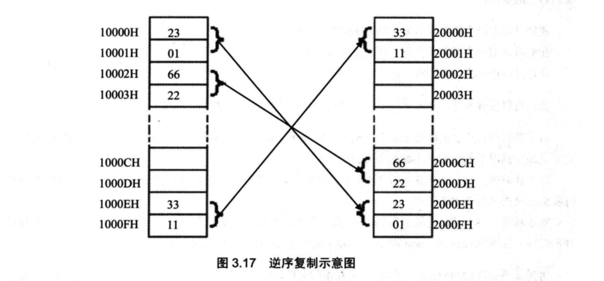

## 补全下面的程序，使其可以将 10000H-1000FH 中的 8 个字，逆序拷贝到


    20000H-2000FH 中。
    mov ax,1000H
    mov ds,ax
    ```
    mov ax,2000H
    mov ss,ax
    mov sp,10H
    ```
    push [0]
    push [2]
    push [4]
    push [6]
    push [8]
    push [A]
    push [C]
    push [E]

## 补全下面的程序，使其可以将 10000H-1000FH 中的 8 个字，逆序拷贝到
    20000H-2000FH 中。
    mov ax,2000H
    mov ds,ax
    ```
    mov ax,1000H
    mov ss,ax
    mov sp,0H
    ```
    pop [e]
    pop [c]
    pop [a]
    pop [8]
    pop [6]
    pop [4]
    pop [2]
    pop [0]
