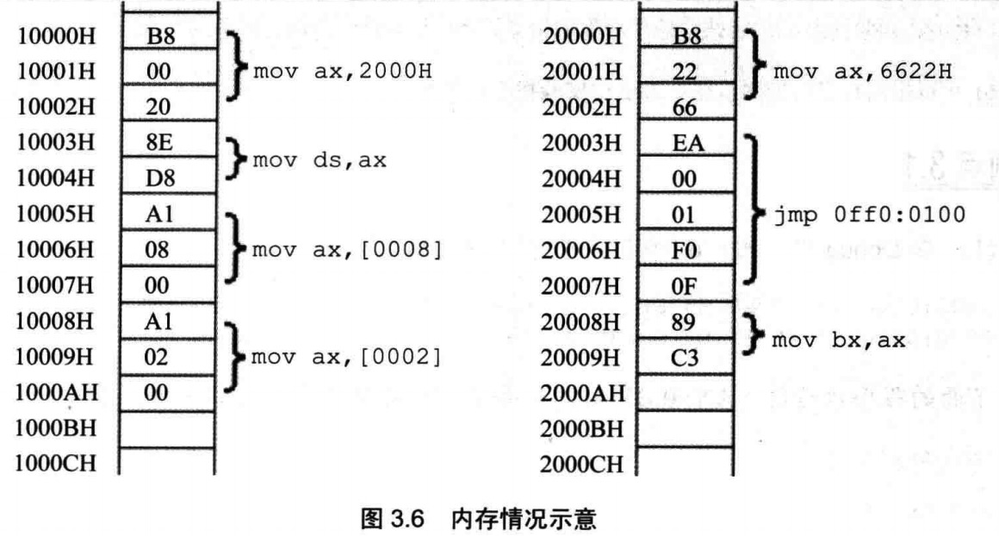

##	在 DEBUG 中,用 "D 0:0 lf" 查看内存,结果如下:
    0000:0000 70 80 F0 30 EF 60 30 E2-00 80 80 12 66 20 22 60
    0000:0010 62 26 E6 D6 CC 2E 3C 3B-AB BA 00 00 26 06 66 88

下面的程序执行前,AX=0,BX=0,写出每条汇编指令执行完后相关寄存器中的值

    mov ax,1  ax = 0001H
    mov ds,ax ds = 0001H
    mov ax,[0000]	ax=2662H
    mov bx,[0001]	bx=E626H
    mov ax,bx	    ax=E626H
    mov ax,[0000]   ax=2662H
    mov bx,[0002]   bx=D6E6H
    add ax,bx	    ax=FD48H
    add ax,[0004]   ax=2C14H
    mov ax,0	    ax=0H
    mov al,[0002]   ax=00E6H
    mov bx,0	    bx=0H
    mov bl,[000c]   bx=0026H
    add al,bl	    ax=000CH

## 内存中的情况如图 3.6 所示,各寄存器的初始值：cs=2000h,ip=0,ds=1000h,ax=0,bx=0;

* 写出CPU执行的指令序列（用汇编指令写出）
* 写出CPU执行每条指令后，CS、IP和相关寄存器中的数值
* 再次体会：数据和程序有区别吗?如何确定内存中的信息哪些是数据，哪些是程序?汇编语言（第3版）



    mov ax, 6622H    cs=2000 ip=0003
    imp offa: 0100   cs=off0 ip=0100
    mov ax, 2000H    cs=off0 ip=0103
    mov ds, ax       cs=off0 ip=0105 ds=2000
    mov ax,[0008]    ax=C389 cs=off0 ip=0108 ds=2000
    mov ax, [0002]   ax=EA66 cs=off0 ip=010B ds=2000

个人总结：数据和程序在内存当中无区别。cs指向的则为程序。ds指向的则为数据。


## 补全下面的程序，使其可以将 10000H-1000FH 中的 8 个字，逆序拷贝到


    20000H-2000FH 中。
    mov ax,1000H
    mov ds,ax
    ```
    mov ax,2000H
    mov ss,ax
    mov sp,10H
    ```
    push [0]
    push [2]
    push [4]
    push [6]
    push [8]
    push [A]
    push [C]
    push [E]

## 补全下面的程序，使其可以将 10000H-1000FH 中的 8 个字，逆序拷贝到
    20000H-2000FH 中。
    mov ax,2000H
    mov ds,ax
    ```
    mov ax,1000H
    mov ss,ax
    mov sp,0H
    ```
    pop [e]
    pop [c]
    pop [a]
    pop [8]
    pop [6]
    pop [4]
    pop [2]
    pop [0]