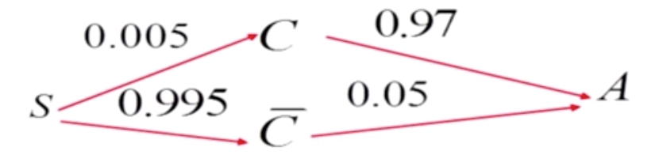

> _参考文章_
> 《概率论与数理统计》浙大版（第四版）教材
> [百度百科](https://baike.baidu.com/item/%E6%9D%A1%E4%BB%B6%E6%A6%82%E7%8E%87)
 

# 基本概念
### 条件概率
条件概率是指事件A在另外一个事件B已经发生条件下的发生概率。条件概率表示为：P（A|B），读作“在B的条件下A的概率”。条件概率可以用决策树进行计算。若只有两个事件A，B，那么$$P(A|B)=\frac{P(A|B)}{P(B)}$$

### 概率测度

如果事件 B 的概率 ``P(B) > 0``那么 ``Q(A) = P(A | B)`` 在所有事件 A 上所定义的函数 Q 就是概率测度。
如果 ``P(B) = 0`` ``P(A | B)`` 没有定义。 条件概率可以用决策树进行计算。

# 基本定理
### 定理1

设`A，B` 是两个事件，且`A`不是不可能事件，则称 \\(P(B|A)=\frac{P(AB)}{P(A)} \\) 为在事件A发生的条件下，事件`B`发生的条件概率。一般地,\\(P(B|A) \neq P(B) \\)，且它满足以下三条件：
（1）非负性；（2）规范性；（3）可列可加性。

### 定理2
设E 为随机试验，`Ω` 为样本空间，`A，B` 为任意两个事件，设`P(A)>0`，称 \\(P(B|A)=\frac{P(AB)}{P(A)} \\) 为在“事件`A` 发生”的条件下事件`B` 的条件概率。
上述乘法公式可推广到任意有穷多个事件时的情况。
设 \\( A_1, A_2 \ldots A_n  \\) 为任意 `n` 个事件`（n≥2）`且 \\( P(A_1, A_2 \ldots A_n  ) > 0\\)则 \\( P(A_1, A_2 \ldots A_n  ) =P(A_1)P(A_2|A_1) \ldots P(A_n|A_1 A_2 \ldots A_{n-1}) \\)

### 定理3 （全概率公式）
如果事件\\(B_1、B_2、B_3 \ldots B_n\\) 构成一个完备事件组，即它们两两互不相容，其和为全集；并且P（Bi)大于0，则对任一事件A有
\\(P(A)=P(A|B_1)P(B_1) + P(A|B_2)P(B_2) + \ldots + P(A|B_n)P(B_n) = \sum_{i=1}^{n} P(A_i)(B|A_i) \\)
特别地，对于任意两随机事件A和B，有如下成立
\\(P(B)=P(B|A)P(A) + P(B|\overline A)P(\overline A)\\)

### 定理4 （贝叶斯公式）
通常，事件A在事件B(发生)的条件下的概率，与事件B在事件A的条件下的概率是不一样的；然而，这两者是有确定的关系,贝叶斯法则就是这种关系的陈述。
\\(P(A_i|B) = \frac{P(B|A_i)P(A_i)}{\sum_{i=1}^{n} P(B|A_i)P(A_i)} \\)

## 例题一
\\(P(A)=\frac{1}{4}, P(B|A)=\frac{1}{3},P(A|B)=\frac{1}{2},求 P(A \cup B),P(\; \bar{A} \; |A \cup B) \\) 

解：
\\( P(B|A) = \frac{P(A \cap B)}{P(A)} = \frac{1}{3} \\) 
\\( P(A|B) = \frac{P(A \cap B)}{P(B)} = \frac{1}{2} \\) 
\\( P(A \cap B) = P(A)P(B|A) = \frac{1}{12} \\) 
\\( P(A) = \frac{1}{4} \\) 
\\( P(B) = \frac{1}{6} \\) 
\\( P(A \cup B) = P(A) + P(B) - P(A \cap B) = \frac{1}{3} \\)
\\(P(\; \bar{A} \; |A \cup B)  = \frac{P({B}-P(A \cap B))}{P(A \cup B)} = \frac{1}{4}\\) 

## 例题二
一个盒子有五个红球，四个白球，采用不放回抽样，每次取一个，取三次。
（1）求前两次中至少有一次取到红球的概率
（2）已知前两次中至少有一次取到红球，求前两次中恰有一次取到红球的概率
（3）求第1，2次取到红球，第三次取到白球的概率

解：
设 
\\(A_i=\begin{Bmatrix}第i次取到红球事件\end{Bmatrix}\\)
\\(B=\begin{Bmatrix}前面两次当中至少有一次取得红球\end{Bmatrix}\\)
\\(C=\begin{Bmatrix}前面两次当中恰好有一次取得红球\end{Bmatrix}\\)
则
\\(P(B) = 1 - P(\overline{B}) = 1- P(\overline{A_1})P(\overline{A_2}|\overline{A_1}) = 1 - \frac{4}{9} \times \frac{3}{8} = \frac{5}{6} \\)
\\(P(C) = 1- P(A_1 A_2|B) =  \frac{2}{3} \\)
\\(P(A_1 A_2 \overline{A_3}) = \frac{5}{9} \times \frac{4}{8} \times \frac{4}{7}=  \frac{10}{63} \\)

## 例题三
某人参加某种考核，已知第一次参加能通过的概率是60%，若第一次未通过，第二次参加能通过的概率是70%，若前两次未通过，第二次参加能通过的概率是80%，求此人最多三次就能通过考核的概率。
解：
设 
\\(A_i=\begin{Bmatrix}第i通过考核\end{Bmatrix}\\)

\\( 1 -  P(\overline{A_1}\overline{A_2}\overline{A_3}) = 1 - 0.4 \times 0.3 \times 0.2 = 0.976  \\)

## 例题四
一小学举办家长开放日，欢迎家长参加活动，小明的母亲参加的概率为80%，若母亲参加，则父亲参加的概率为30%，若母亲不参加，则父亲参加的概率为90%。
（1）求父母都参加的概率
（2）求父母参加的概率
（3）在已知父亲参加的条件下，求母亲参加的概率

解：
设 
\\(A=\begin{Bmatrix}母亲参加\end{Bmatrix}\\)
\\(B=\begin{Bmatrix}父亲参加\end{Bmatrix}\\)
\\(P(A) = 0.8\\)
\\(P(B|A)=0.3\\)
\\(P(B|\overline{A}) = 0.9\\)
\\(P(B|A)= \frac{P(AB)}{P(A)} = 0.3 => P(AB)=0.24\\)
\\(P(B)= P(A)P(B|A) + P(\overline{A})P(B|\overline{A}) = 0.8 \times 0.3 + 0.2 \times 0.9 = 0.42  \\)
\\(P(A|B)= \frac{P(AB)}{P(B)} = \frac{4}{7} \\)

## 例题五
有甲乙两盒，甲盒有三个红球两个白球，乙盒有两个红球，一个白球。先从甲盒中采用不放回抽样取3球放入到乙盒，再从乙盒中取一个球，球取到的是红球的概率。
解：
设 
\\(A=\begin{Bmatrix}甲盒中取球\end{Bmatrix}\\)
\\(B=\begin{Bmatrix}乙盒中去球\end{Bmatrix}\\)
\\(
P(B)=P(B|A_1) \times P(A_1) + P(B|A_2) \times P(A_2) + P(B|A_3) \times P(A_3) =   \\\\
\frac{1}{2} \times \frac{C_{3}^{1}C_{2}^{2}}{C_{5}^{3}} + \frac{2}{3} \times \frac{C_{3}^{2}C_{2}^{1}}{C_{5}^{3}} + \frac{5}{6} \times \frac{C_{3}^{3}}{C_{5}^{3}} = \frac{19}{30} \\\\
\\)

## 例题六
根据以往的临床记录某种诊断癌症的试验具有5%的假阳性以及%3的假阴性
若设
 `A={试验反应是阳性}` `C={被诊断患有癌症}`
则有
\\(P(A| \overline{C}) = 5\% \\)
\\(P(\overline{A}|C) = 3\% \\)
已知某一群体`P(C) = 0.005`,问这种方法能否用于普查。

\\(
P(C|A) = \frac{P(CA)}{P(A)} = \frac{P(CA)}{P(A|C)P(C) + P(A|\overline{C})P(\overline{C})} = 0.08882783882783883
\\)