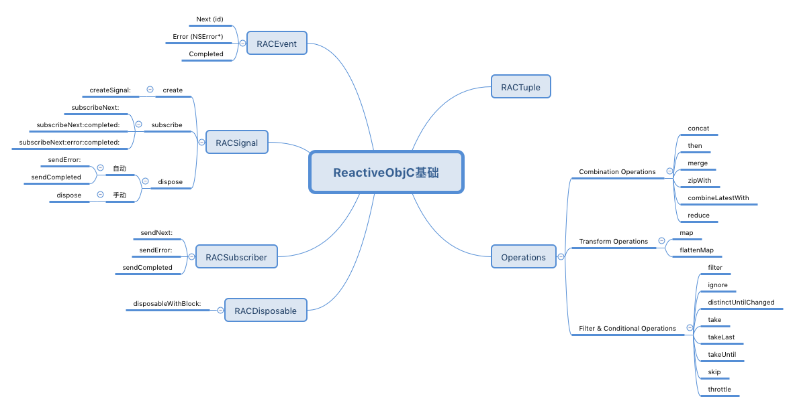
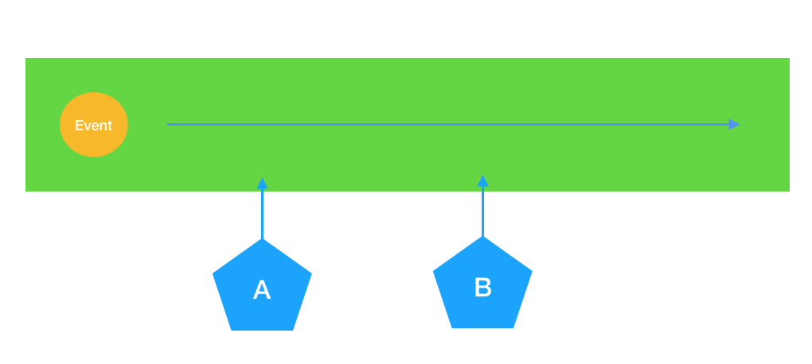
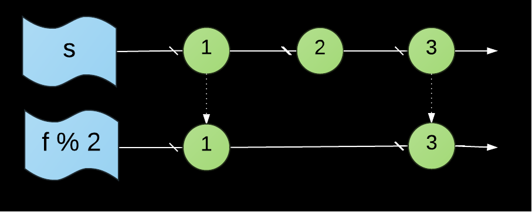
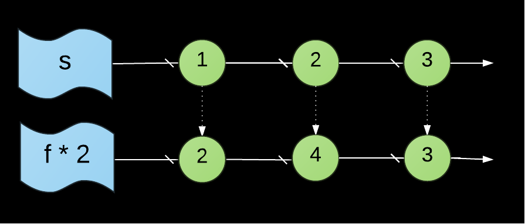
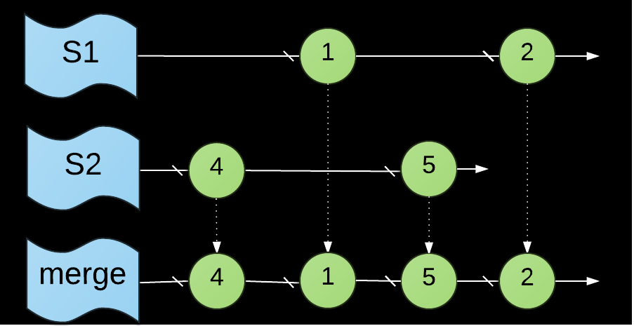
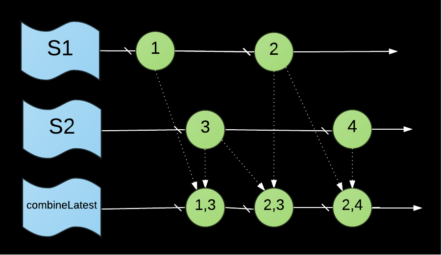
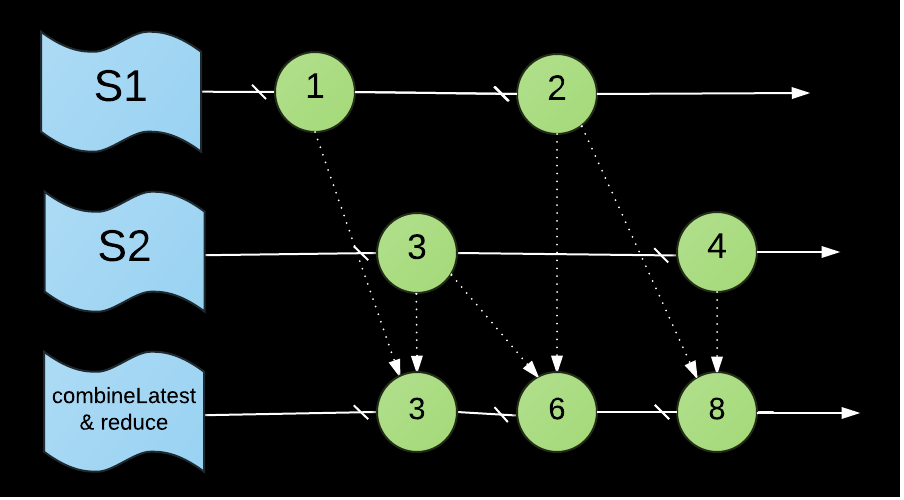
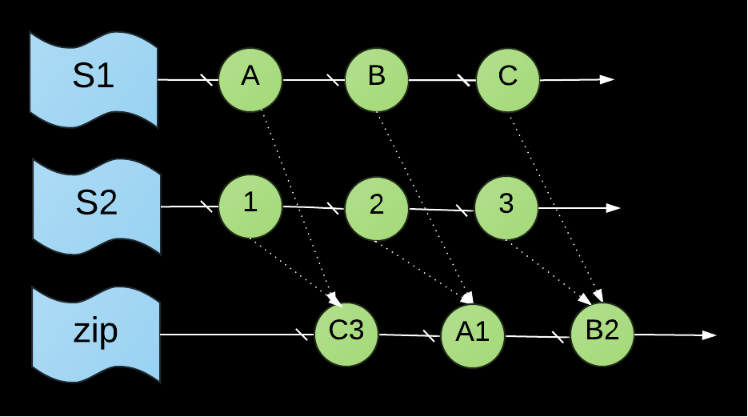

## ReactiveObjC简介

ReactiveCocoa-简称为RAC，现在可分为OC版本-ReactiveObjC和swift版本-ReactiveSwift。本篇文章仅介绍ReactiveObjC。
RAC是一个将函数响应式编程范式带入iOS的开源库，其兼具函数式与响应式的特性。它是由`Josh Abernathy`和`Justin Spahr-Summers`当初在开发`GitHub for Mac` 过程中创造的，灵感来源于[Functional Reactive Programming](https://en.wikipedia.org/wiki/Functional_reactive_programming)。

现在有下面4个概念，需要我们理清一下它们概念：
面向对象编程 Object Oriented Programming
响应式编程 Reactive Programming
函数式编程 Functional Programming
函数响应式编程 Functional Reactive Programming

### 响应式编程
在计算机中，响应式编程或反应式编程（英语：Reactive programming）是一种面向数据流和变化传播的编程范式。这意味着可以在编程语言中很方便地表达静态或动态的数据流，而相关的计算模型会自动将变化的值通过数据流进行传播。
例如，在命令式编程环境中，`a=b+c`表示将表达式的结果赋给`a`，而之后改变`b`或`c`的值不会影响`a`。但在响应式编程中，`a`的值会随着`b`或`c`的更新而更新。
电子表格程序就是响应式编程的一个例子。单元格可以包含字面值或类似`=B1+C1`的公式，而包含公式的单元格的值会依据其他单元格的值的变化而变化 。
> [维基百科-响应式编程](https://zh.wikipedia.org/wiki/%E5%93%8D%E5%BA%94%E5%BC%8F%E7%BC%96%E7%A8%8B)

### 函数式编程
函数式编程是一种编程范式，我们常见的编程范式有命令式编程（Imperative programming），函数式编程，逻辑式编程，常见的面向对象编程是也是一种命令式编程。
命令式编程是面向计算机硬件的抽象，有变量（对应着存储单元），赋值语句（获取，存储指令），表达式（内存引用和算术运算）和控制语句（跳转指令），一句话，命令式程序就是一个冯诺依曼机的指令序列。 而函数式编程是面向数学的抽象，将计算描述为一种表达式求值，一句话，函数式程序就是一个表达式。

## 基本概念

这里需要优先关注左边的几个类。
RACEvent：事件
RACSignal：信号（管道）
RACSubscribe：订阅者
RACDisposable： 清理者

这四个类提供了 ReactiveObjC 响应式思想的支持（使用异步数据流进行编程）。首先我们通过一个简单的例子来看下 ReactiveObjC是如何工作的。

```
UIButton * btn = [UIButton buttonWithType:UIButtonTypeCustom];
btn.frame = CGRectMake(100, 200, 100, 60);
btn.backgroundColor = [UIColor blueColor];
[self.view addSubview:btn];
//监听点击事件
[[btn rac_signalForControlEvents:UIControlEventTouchUpInside] subscribeNext:^(__kindof UIControl * _Nullable x) {
    NSLog(@"%@",x);
}];

```
这里我们在点击了按钮后。后台会打印出 log。那么中间发生了什么呢。
首先，我们通过 
```
[btn rac_signalForControlEvents:UIControlEventTouchUpInside]
```
创建了一个管道`RACSignal`。然后又给这个管道插入了一个订阅者`RACSubscribe：订阅者`.
```
subscribeNext:^(__kindof UIControl * _Nullable x) {
    NSLog(@"%@",x);
}
```
当按钮被点击时。会向管道里抛出一个事件`RACEvent`。当这个管道有订阅者的时候。就会把事件`RACEvent`交付给订阅者来处理。



## 基础使用
> https://lpd-ios.github.io/2016/10/10/ReactiveCocoa-Basic-Function/

### filter
```
RACSignal *signal = [@[ @1, @2, @3 ] rac_sequence].signal;
signal = [signal filter:^BOOL(NSNumber *value) {
    return value.integerValue % 2;
}];
[signal subscribeNext:^(NSNumber *value) {
    NSLog(@"%@", value);
}];
```


### map
```
RACSignal *signal = [@[ @1, @2, @3 ] rac_sequence].signal;
signal = [signal map:^id(NSNumber *value) {
return @(value.integerValue * 2);
}];
[signal subscribeNext:^(NSNumber *value) {
NSLog(@"%@", value);
}];
```


### merge
```
RACSignal *signal1 = [@[ @1, @2 ] rac_sequence].signal;
RACSignal *signal2 = [@[ @4, @5 ] rac_sequence].signal;
[[signal1 merge:signal2] subscribeNext:^(NSNumber *value) {
    NSLog(@"%@", value);
}];
```


### combineLatest
```
RACSignal *signal1 = [@[ @1, @2 ] rac_sequence].signal;
RACSignal *signal2 = [@[ @3, @4 ] rac_sequence].signal;

[[signal1 combineLatestWith:signal2] subscribeNext:^(RACTuple *value) {
NSLog(@"%@", value);
}];
```


### combineLatest & reduce
```
RACSignal *signal1 = [@[ @1, @2 ] rac_sequence].signal;
RACSignal *signal2 = [@[ @3, @4 ] rac_sequence].signal;

[[[signal1 combineLatestWith:signal2]
    reduceEach:^id(NSNumber *v1, NSNumber *v2) {
    return @(v1.integerValue * v2.integerValue);
    }] subscribeNext:^(RACTuple *value) {
NSLog(@"%@", value);
}];
```


### zip
```
RACSubject *letters = [RACSubject subject];
RACSubject *numbers = [RACSubject subject];

RACSignal *combined =
    [RACSignal zip:@[ letters, numbers ]
            reduce:^(NSString *letter, NSString *number) {
              return [letter stringByAppendingString:number];
            }];

// Outputs: A1 B2 C3
[combined subscribeNext:^(id x) {
  NSLog(@"%@", x);
}];

[letters sendNext:@"A"];
[letters sendNext:@"B"];
[letters sendNext:@"C"];
[numbers sendNext:@"1"];
[numbers sendNext:@"2"];
[numbers sendNext:@"3"];
```
