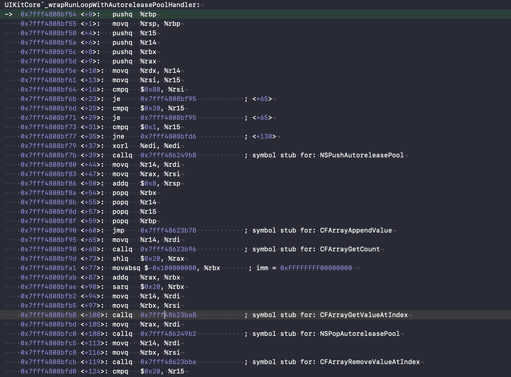

分析使用的RunLoop源码版本: [CF-1153.18.tar](https://opensource.apple.com/tarballs/CF/)
官方示例使用讲解: [链接地址](https://developer.apple.com/library/archive/documentation/Cocoa/Conceptual/Multithreading/RunLoopManagement/RunLoopManagement.html#//apple_ref/doc/uid/10000057i-CH16-SW23)

# RunLoop 是什么？
一般来讲，一个线程一次只能执行一个任务，执行完成后线程就会退出。如果我们需要一个机制，让线程能随时处理事件但并不退出，通常的代码逻辑是这样的：

```
function loop() {
    initialize();
    do {
        var message = get_next_message();
        process_message(message);
    } while (message != quit);
}
```
这种模型通常被称作 Event Loop。 Event Loop 在很多系统和框架里都有实现，比如 Node.js 的事件处理，比如 Windows 程序的消息循环，再比如 OSX/iOS 里的 RunLoop。实现这种模型的关键点在于：如何管理事件/消息，如何让线程在没有处理消息时休眠以避免资源占用、在有消息到来时立刻被唤醒。

所以，RunLoop 实际上就是一个对象，这个对象管理了其需要处理的事件和消息，并提供了一个入口函数来执行上面 Event Loop 的逻辑。线程执行了这个函数后，就会一直处于这个函数内部 “接受消息->等待->处理” 的循环中，直到这个循环结束（比如传入 quit 的消息），函数返回。

OSX/iOS 系统中，提供了两个这样的对象：NSRunLoop 和 CFRunLoopRef。
CFRunLoopRef 是在 CoreFoundation 框架内的，它提供了纯 C 函数的 API，所有这些 API 都是线程安全的。
NSRunLoop 是基于 CFRunLoopRef 的封装，提供了面向对象的 API，但是这些 API 不是线程安全的。


# 如何创建 RunLoop 
苹果并未提供创建`RunLoop`的方式，而是通过线程来获取。

    [NSRunLoop mainRunLoop]
    [NSRunLoop currentRunLoop]
    
对应到源码分别是获取主线程的`CFRunLoopGetMain()` 和 获取当前线程的`CFRunLoopGetCurrent()`。对应的源码为。

    CFRunLoopRef CFRunLoopGetMain(void) {
        CHECK_FOR_FORK();
        static CFRunLoopRef __main = NULL; // no retain needed
        if (!__main) __main = _CFRunLoopGet0(pthread_main_thread_np()); // no CAS needed
        return __main;
    }

    CFRunLoopRef CFRunLoopGetCurrent(void) {
        CHECK_FOR_FORK();
        CFRunLoopRef rl = (CFRunLoopRef)_CFGetTSD(__CFTSDKeyRunLoop);
        if (rl) return rl;
        return _CFRunLoopGet0(pthread_self());
    }
通过代码可以发现，获取主线程的 RunLoop 是通过静态变量保存的，且为懒加载，需要时才被创建。获取子线程 RunLoop 先从 Map 中获取，如果没有获取到，创建一个，并将其放入 Map 中。接下来看一下创建的函数`_CFRunLoopGet0`。

    // 删除了部分不重要代码
    CF_EXPORT CFRunLoopRef _CFRunLoopGet0(pthread_t t) {

        if (!__CFRunLoops) {
            // 第一次获取 Runloop 时，创建全局 Map
            CFMutableDictionaryRef dict = CFDictionaryCreateMutable(kCFAllocatorSystemDefault, 0, NULL, &kCFTypeDictionaryValueCallBacks);

            // 为主线程创建一个 Runloop
            CFRunLoopRef mainLoop = __CFRunLoopCreate(pthread_main_thread_np());

            // 使用全局 Map 保存主线程 Runloop
            CFDictionarySetValue(dict, pthreadPointer(pthread_main_thread_np()), mainLoop);
        }

        // 通过全局 Map 获取 Runloop
        CFRunLoopRef loop = (CFRunLoopRef)CFDictionaryGetValue(__CFRunLoops, pthreadPointer(t));


        if (!loop) {
            // 如果未获取到 则创建一个
            CFRunLoopRef newLoop = __CFRunLoopCreate(t);
            // 重新获取一次 避免创建重复
            loop = (CFRunLoopRef)CFDictionaryGetValue(__CFRunLoops, pthreadPointer(t));
            if (!loop) {
                // 还是没有的话 将新创建的 Runloop 放入到全局 Map 中
                CFDictionarySetValue(__CFRunLoops, pthreadPointer(t), newLoop);
                loop = newLoop;
            }
        }
        return loop;
    }

至于 __CFRunLoopCreate 创建函数则是创建了一个 CFRunLoopRef 类型的实例。并将其初始化。

    static CFRunLoopRef __CFRunLoopCreate(pthread_t t) {
        CFRunLoopRef loop = NULL;
        CFRunLoopModeRef rlm;
        uint32_t size = sizeof(struct __CFRunLoop) - sizeof(CFRuntimeBase);
        loop = (CFRunLoopRef)_CFRuntimeCreateInstance(kCFAllocatorSystemDefault, CFRunLoopGetTypeID(), size, NULL);
        if (NULL == loop) {
        return NULL;
        }
        (void)__CFRunLoopPushPerRunData(loop);
        __CFRunLoopLockInit(&loop->_lock);
        loop->_wakeUpPort = __CFPortAllocate();
        if (CFPORT_NULL == loop->_wakeUpPort) HALT;
        __CFRunLoopSetIgnoreWakeUps(loop);
        loop->_commonModes = CFSetCreateMutable(kCFAllocatorSystemDefault, 0, &kCFTypeSetCallBacks);
        CFSetAddValue(loop->_commonModes, kCFRunLoopDefaultMode);
        loop->_commonModeItems = NULL;
        loop->_currentMode = NULL;
        loop->_modes = CFSetCreateMutable(kCFAllocatorSystemDefault, 0, &kCFTypeSetCallBacks);
        loop->_blocks_head = NULL;
        loop->_blocks_tail = NULL;
        loop->_counterpart = NULL;
        loop->_pthread = t;
    #if DEPLOYMENT_TARGET_WINDOWS
        loop->_winthread = GetCurrentThreadId();
    #else
        loop->_winthread = 0;
    #endif
        rlm = __CFRunLoopFindMode(loop, kCFRunLoopDefaultMode, true);
        if (NULL != rlm) __CFRunLoopModeUnlock(rlm);
        return loop;
    }


# RunLoop 是如何运行的
要了解 RunLoop 是如何运行的，首先得先看一下他的结构。
## RunLoop的结构

    struct __CFRunLoop {
        CFRuntimeBase _base;
        pthread_mutex_t _lock;			/* locked for accessing mode list */
        __CFPort _wakeUpPort;			// used for CFRunLoopWakeUp 
        Boolean _unused;
        volatile _per_run_data *_perRunData;              // reset for runs of the run loop
        pthread_t _pthread;
        uint32_t _winthread;
        CFMutableSetRef _commonModes;
        CFMutableSetRef _commonModeItems;
        CFRunLoopModeRef _currentMode;
        CFMutableSetRef _modes;
        struct _block_item *_blocks_head;
        struct _block_item *_blocks_tail;
        CFAbsoluteTime _runTime;
        CFAbsoluteTime _sleepTime;
        CFTypeRef _counterpart;
    };

接下来分析一波,其中主要关注的是。

| 类型 | 变量名 | 作用 |
| :----:| :----: | :----: |
|pthread_mutex_t|_lock| 用来锁对于 model 的访问的 |
|__CFPort|_wakeUpPort|唤醒当前 Runloop 的 port|
|pthread_t|	_pthread|记录当前线程|
|CFMutableSetRef|_commonModes|保存定义为 common 的 mode 的集合|
|CFMutableSetRef|_commonModeItems|保存定义为 common 的 mode 的 source、timer 和 observe|
|CFRunLoopModeRef|_currentMode|当前运行在哪个 mode 下|
|CFMutableSetRef|_modes|所有的 mode 的集合|


## CFRunLoopModeRef的结构

    typedef struct __CFRunLoopMode *CFRunLoopModeRef;

    struct __CFRunLoopMode {
        CFRuntimeBase _base;
        pthread_mutex_t _lock;	/* must have the run loop locked before locking this */
        CFStringRef _name;
        Boolean _stopped;
        char _padding[3];
        CFMutableSetRef _sources0;
        CFMutableSetRef _sources1;
        CFMutableArrayRef _observers;
        CFMutableArrayRef _timers;
        CFMutableDictionaryRef _portToV1SourceMap;
        __CFPortSet _portSet;
        CFIndex _observerMask;
    #if USE_DISPATCH_SOURCE_FOR_TIMERS
        dispatch_source_t _timerSource;
        dispatch_queue_t _queue;
        Boolean _timerFired; // set to true by the source when a timer has fired
        Boolean _dispatchTimerArmed;
    #endif
    #if USE_MK_TIMER_TOO
        mach_port_t _timerPort;
        Boolean _mkTimerArmed;
    #endif
    #if DEPLOYMENT_TARGET_WINDOWS
        DWORD _msgQMask;
        void (*_msgPump)(void);
    #endif
        uint64_t _timerSoftDeadline; /* TSR */
        uint64_t _timerHardDeadline; /* TSR */
    };

他们的作用是

| 类型 | 变量名 | 作用 |
| :----:| :----: | :----: |
|pthread_mutex_t|_lock| 用来锁对于 model 的访问的 |
|CFStringRef|_name|当前 mode 的名称|
|CFMutableSetRef|_sources0|sources0的集合|
|CFMutableSetRef|_sources1|sources1的集合|
|CFMutableArrayRef|_observers|监听者的集合|
|CFMutableArrayRef|_timers|定时器的集合|
|CFMutableDictionaryRef|_portToV1SourceMap|一个字典用于记录 MachPort 和source1的映射关系|
|__CFPortSet|_portSet|端口的集合|
|dispatch_source_t|_timerSource|DISPATCH的定时器|
|dispatch_queue_t|_queue|_timerSource的队列|
|mach_port_t|_timerPort| MK 定时器端口|

### source0 和 sources1 的区别
其中需要注意的是 `sources0` 看起来和 `sources1` 差不多，其实还是又区别的。从源码的角度上来看 
`source0` 最终执行到`__CFRUNLOOP_IS_CALLING_OUT_TO_A_SOURCE0_PERFORM_FUNCTION__`
而`sources1`最终执行到`__CFRUNLOOP_IS_CALLING_OUT_TO_A_SOURCE1_PERFORM_FUNCTION__`

    static void __CFRUNLOOP_IS_CALLING_OUT_TO_A_SOURCE0_PERFORM_FUNCTION__() __attribute__((noinline));
    static void __CFRUNLOOP_IS_CALLING_OUT_TO_A_SOURCE0_PERFORM_FUNCTION__(void (*perform)(void *), void *info) {
        if (perform) {
            perform(info);
        }
        asm __volatile__(""); // thwart tail-call optimization
    }

    static void __CFRUNLOOP_IS_CALLING_OUT_TO_A_SOURCE1_PERFORM_FUNCTION__() __attribute__((noinline));
    static void __CFRUNLOOP_IS_CALLING_OUT_TO_A_SOURCE1_PERFORM_FUNCTION__(
    #if DEPLOYMENT_TARGET_MACOSX || DEPLOYMENT_TARGET_EMBEDDED || DEPLOYMENT_TARGET_EMBEDDED_MINI
            void *(*perform)(void *msg, CFIndex size, CFAllocatorRef allocator, void *info),
            mach_msg_header_t *msg, CFIndex size, mach_msg_header_t **reply,
    #else
            void (*perform)(void *),
    #endif
            void *info) {
        if (perform) {
    #if DEPLOYMENT_TARGET_MACOSX || DEPLOYMENT_TARGET_EMBEDDED || DEPLOYMENT_TARGET_EMBEDDED_MINI
            *reply = perform(msg, size, kCFAllocatorSystemDefault, info);
    #else
            perform(info);
    #endif
        }
        asm __volatile__(""); // thwart tail-call optimization
    }
对比源码发现`source`在 `MACOSX` 平台和`EMBEDDED`(嵌入式平台)做了一些涉及内核`mach_msg`的操作，想了解具体内容的同学可以自行搜索，我也还没太弄清楚。

## Runloop 的入口
苹果为`NSRunLoop`提供了三个运行函数，分别是

    - (void)run; 
    - (void)runUntilDate:(NSDate *)limitDate;
    - (BOOL)runMode:(NSRunLoopMode)mode beforeDate:(NSDate *)limitDate;

但是其实只有两个函数起作用`run`函数的内部其实是调用了`runUntilDate`,想了解`NSRunloop`的源码的朋友可以通过[genstep](https://github.com/gnustep/libs-base/blob/master/Source/NSRunLoop.m)查看。而其最终对应的`Runloop`为


    void CFRunLoopRun(void) {	/* DOES CALLOUT */
        int32_t result;
        do {
            result = CFRunLoopRunSpecific(CFRunLoopGetCurrent(), kCFRunLoopDefaultMode, 1.0e10, false);
            CHECK_FOR_FORK();
        } while (kCFRunLoopRunStopped != result && kCFRunLoopRunFinished != result);
    }

    SInt32 CFRunLoopRunInMode(CFStringRef modeName, CFTimeInterval seconds, Boolean returnAfterSourceHandled) {     /* DOES CALLOUT */
        CHECK_FOR_FORK();
        return CFRunLoopRunSpecific(CFRunLoopGetCurrent(), modeName, seconds, returnAfterSourceHandled);
    }
会发现他们最终都会调用`CFRunLoopRunSpecific`函数

    SInt32 CFRunLoopRunSpecific(CFRunLoopRef rl, CFStringRef modeName, CFTimeInterval seconds, Boolean returnAfterSourceHandled) {     /* DOES CALLOUT */
        CHECK_FOR_FORK();

        if (__CFRunLoopIsDeallocating(rl)) return kCFRunLoopRunFinished;

        __CFRunLoopLock(rl);
        CFRunLoopModeRef currentMode = __CFRunLoopFindMode(rl, modeName, false);
        if (NULL == currentMode || __CFRunLoopModeIsEmpty(rl, currentMode, rl->_currentMode)) {
            Boolean did = false;
            if (currentMode) __CFRunLoopModeUnlock(currentMode);
            __CFRunLoopUnlock(rl);
            return did ? kCFRunLoopRunHandledSource : kCFRunLoopRunFinished;
        }
        volatile _per_run_data *previousPerRun = __CFRunLoopPushPerRunData(rl);
        CFRunLoopModeRef previousMode = rl->_currentMode;
        rl->_currentMode = currentMode;
        int32_t result = kCFRunLoopRunFinished;

        if (currentMode->_observerMask & kCFRunLoopEntry ) __CFRunLoopDoObservers(rl, currentMode, kCFRunLoopEntry);
        result = __CFRunLoopRun(rl, currentMode, seconds, returnAfterSourceHandled, previousMode);
        if (currentMode->_observerMask & kCFRunLoopExit ) __CFRunLoopDoObservers(rl, currentMode, kCFRunLoopExit);

            __CFRunLoopModeUnlock(currentMode);
            __CFRunLoopPopPerRunData(rl, previousPerRun);
        rl->_currentMode = previousMode;
        __CFRunLoopUnlock(rl);
        return result;
    }

这里主要的逻辑是各种判空处理和设置currentMode以及通知`Observers`涉及到的`Runloop`的两种状态`kCFRunLoopEntry` `kCFRunLoopExit`。真正涉及到`source` `timer`等事件处理主要是在`__CFRunLoopRun` 函数中，代码太长就不贴了。最终运行逻辑如下图黑圈部分。


# 定时器
iOS定时器大致三种
### NSTimer
这里有 gnustep 给出的[源码地址](https://github.com/gnustep/libs-base/blob/master/Source/NSTimer.m)，想要了解的朋友可以去查看。其本质也就是`CFRunLoopTimerRef`，需要将其添加进`Runloop`中才可以运行。优点是面向对象使用，用起来比较方便，缺点是需要将其添加进入标记为`common`的`Runloop`中，因为`timer`默认是添加的 default 的 mode 中，在用户拖拽滚动屏幕时会造成回调事件无法响应。另外由于是依赖`Runloop`所以如果单次`Runloop`处理的事情较多，耗时比较久，会造成响应的时间不准确。

### CADisplayLink
`CADisplayLink`是一个和屏幕刷新率一致的定时器。运行时仍然依赖`Runloop`，但其原理和`NSTimer`不同，后续会有单独博客来写。每当屏幕显示内容刷新结束的时候，`Runloop`就会向`CADisplayLink`指定的`target`发送一次指定的`selector`消息， `CADisplayLink`类对应的 `selector` 就会被调用一次。如果在两次屏幕刷新之间执行了一个长任务，那其中就会有一帧被跳过，那么回调事件也将少一次，经常被用作监控`FPS`。

### GCD
精确度高，不受`Runloop`影响

    // 创建GCD定时器
    dispatch_queue_t queue = dispatch_get_global_queue(DISPATCH_QUEUE_PRIORITY_DEFAULT, 0);

    dispatch_source_t _timer = dispatch_source_create(DISPATCH_SOURCE_TYPE_TIMER, 0, 0, queue);

    dispatch_source_set_timer(_timer, dispatch_walltime(NULL, 0), 1.0 * NSEC_PER_SEC, 0); //每秒执行

    // 事件回调
    dispatch_source_set_event_handler(_timer, ^{
            
        dispatch_async(dispatch_get_main_queue(), ^{
            // 在主线程中实现需要的功能
            
        }
    }
        
    });

    // 开启定时器
    dispatch_resume(_timer);

    // 挂起定时器（dispatch_suspend 之后的 Timer，是不能被释放的！会引起崩溃）
    dispatch_suspend(_timer);

    // 关闭定时器
    dispatch_source_cancel(_timer);

# Autorelease

在APP启动时打印`[NSRunloop mainRunLoop]`

    <CFRunLoop 0x60000186c000 [0x7fff80617cb0]>{wakeup port = 0x1a03, stopped = false, ignoreWakeUps = false, 
    current mode = kCFRunLoopDefaultMode,
    common modes = <CFBasicHash 0x600002a52160 [0x7fff80617cb0]>{type = mutable set, count = 2,
    entries =>
        0 : <CFString 0x7fff867f6c40 [0x7fff80617cb0]>{contents = "UITrackingRunLoopMode"}
        2 : <CFString 0x7fff8062b0a0 [0x7fff80617cb0]>{contents = "kCFRunLoopDefaultMode"}
    }
    ,
    common mode items = <CFBasicHash 0x600002a52c70 [0x7fff80617cb0]>{type = mutable set, count = 11,
    entries =>
        0 : <CFRunLoopSource 0x60000116c180 [0x7fff80617cb0]>{signalled = No, valid = Yes, order = -1, context = <CFRunLoopSource context>{version = 0, info = 0x0, callout = PurpleEventSignalCallback (0x7fff384c19f5)}}
        1 : <CFRunLoopObserver 0x60000156c5a0 [0x7fff80617cb0]>{valid = Yes, activities = 0xa0, repeats = Yes, order = 2000000, callout = _ZN2CA11Transaction17observer_callbackEP19__CFRunLoopObservermPv (0x7fff2b0c046e), context = <CFRunLoopObserver context 0x0>}
        2 : <CFRunLoopObserver 0x60000156c460 [0x7fff80617cb0]>{valid = Yes, activities = 0x1, repeats = Yes, order = -2147483647, callout = _wrapRunLoopWithAutoreleasePoolHandler (0x7fff4808bf54), context = <CFArray 0x600002a04a80 [0x7fff80617cb0]>{type = mutable-small, count = 1, values = (
        0 : <0x7f8956803038>
    )}}
        3 : <CFRunLoopSource 0x60000116c600 [0x7fff80617cb0]>{signalled = No, valid = Yes, order = -2, context = <CFRunLoopSource context>{version = 0, info = 0x600002a31ef0, callout = __handleHIDEventFetcherDrain (0x7fff48126da3)}}
        6 : <CFRunLoopSource 0x6000011683c0 [0x7fff80617cb0]>{signalled = No, valid = Yes, order = 0, context = <CFRunLoopSource context>{version = 0, info = 0x60000007c0c0, callout = FBSSerialQueueRunLoopSourceHandler (0x7fff3662186a)}}
        7 : <CFRunLoopObserver 0x60000156c320 [0x7fff80617cb0]>{valid = Yes, activities = 0xa0, repeats = Yes, order = 1999000, callout = _beforeCACommitHandler (0x7fff480bc2eb), context = <CFRunLoopObserver context 0x7f8954c01140>}
        8 : <CFRunLoopSource 0x600001160300 [0x7fff80617cb0]>{signalled = No, valid = Yes, order = -1, context = <CFRunLoopSource context>{version = 1, info = 0x3003, callout = PurpleEventCallback (0x7fff384c1a01)}}
        9 : <CFRunLoopObserver 0x60000156c500 [0x7fff80617cb0]>{valid = Yes, activities = 0xa0, repeats = Yes, order = 2147483647, callout = _wrapRunLoopWithAutoreleasePoolHandler (0x7fff4808bf54), context = <CFArray 0x600002a04a80 [0x7fff80617cb0]>{type = mutable-small, count = 1, values = (
        0 : <0x7f8956803038>
    )}}
        10 : <CFRunLoopObserver 0x6000015646e0 [0x7fff80617cb0]>{valid = Yes, activities = 0x20, repeats = Yes, order = 0, callout = _UIGestureRecognizerUpdateObserver (0x7fff47c2f06a), context = <CFRunLoopObserver context 0x600000f656c0>}
        11 : <CFRunLoopObserver 0x60000156c3c0 [0x7fff80617cb0]>{valid = Yes, activities = 0xa0, repeats = Yes, order = 2001000, callout = _afterCACommitHandler (0x7fff480bc354), context = <CFRunLoopObserver context 0x7f8954c01140>}
        12 : <CFRunLoopSource 0x60000116c3c0 [0x7fff80617cb0]>{signalled = No, valid = Yes, order = -1, context = <CFRunLoopSource context>{version = 0, info = 0x600001160480, callout = __handleEventQueue (0x7fff48126d97)}}
    }
    ,
    modes = <CFBasicHash 0x600002a51ec0 [0x7fff80617cb0]>{type = mutable set, count = 3,
    entries =>
        0 : <CFRunLoopMode 0x600001f68270 [0x7fff80617cb0]>{name = UITrackingRunLoopMode, port set = 0x1f03, queue = 0x600000a6c980, source = 0x600000a6ca80 (not fired), timer port = 0x2a03, 
        sources0 = <CFBasicHash 0x600002a52cd0 [0x7fff80617cb0]>{type = mutable set, count = 4,
    entries =>
        0 : <CFRunLoopSource 0x60000116c180 [0x7fff80617cb0]>{signalled = No, valid = Yes, order = -1, context = <CFRunLoopSource context>{version = 0, info = 0x0, callout = PurpleEventSignalCallback (0x7fff384c19f5)}}
        3 : <CFRunLoopSource 0x60000116c3c0 [0x7fff80617cb0]>{signalled = No, valid = Yes, order = -1, context = <CFRunLoopSource context>{version = 0, info = 0x600001160480, callout = __handleEventQueue (0x7fff48126d97)}}
        4 : <CFRunLoopSource 0x6000011683c0 [0x7fff80617cb0]>{signalled = No, valid = Yes, order = 0, context = <CFRunLoopSource context>{version = 0, info = 0x60000007c0c0, callout = FBSSerialQueueRunLoopSourceHandler (0x7fff3662186a)}}
        5 : <CFRunLoopSource 0x60000116c600 [0x7fff80617cb0]>{signalled = No, valid = Yes, order = -2, context = <CFRunLoopSource context>{version = 0, info = 0x600002a31ef0, callout = __handleHIDEventFetcherDrain (0x7fff48126da3)}}
    }
    ,
        sources1 = <CFBasicHash 0x600002a52d00 [0x7fff80617cb0]>{type = mutable set, count = 1,
    entries =>
        0 : <CFRunLoopSource 0x600001160300 [0x7fff80617cb0]>{signalled = No, valid = Yes, order = -1, context = <CFRunLoopSource context>{version = 1, info = 0x3003, callout = PurpleEventCallback (0x7fff384c1a01)}}
    }
    ,
        observers = (
        "<CFRunLoopObserver 0x60000156c460 [0x7fff80617cb0]>{valid = Yes, activities = 0x1, repeats = Yes, order = -2147483647, callout = _wrapRunLoopWithAutoreleasePoolHandler (0x7fff4808bf54), context = <CFArray 0x600002a04a80 [0x7fff80617cb0]>{type = mutable-small, count = 1, values = (\n\t0 : <0x7f8956803038>\n)}}",
        "<CFRunLoopObserver 0x6000015646e0 [0x7fff80617cb0]>{valid = Yes, activities = 0x20, repeats = Yes, order = 0, callout = _UIGestureRecognizerUpdateObserver (0x7fff47c2f06a), context = <CFRunLoopObserver context 0x600000f656c0>}",
        "<CFRunLoopObserver 0x60000156c320 [0x7fff80617cb0]>{valid = Yes, activities = 0xa0, repeats = Yes, order = 1999000, callout = _beforeCACommitHandler (0x7fff480bc2eb), context = <CFRunLoopObserver context 0x7f8954c01140>}",
        "<CFRunLoopObserver 0x60000156c5a0 [0x7fff80617cb0]>{valid = Yes, activities = 0xa0, repeats = Yes, order = 2000000, callout = _ZN2CA11Transaction17observer_callbackEP19__CFRunLoopObservermPv (0x7fff2b0c046e), context = <CFRunLoopObserver context 0x0>}",
        "<CFRunLoopObserver 0x60000156c3c0 [0x7fff80617cb0]>{valid = Yes, activities = 0xa0, repeats = Yes, order = 2001000, callout = _afterCACommitHandler (0x7fff480bc354), context = <CFRunLoopObserver context 0x7f8954c01140>}",
        "<CFRunLoopObserver 0x60000156c500 [0x7fff80617cb0]>{valid = Yes, activities = 0xa0, repeats = Yes, order = 2147483647, callout = _wrapRunLoopWithAutoreleasePoolHandler (0x7fff4808bf54), context = <CFArray 0x600002a04a80 [0x7fff80617cb0]>{type = mutable-small, count = 1, values = (\n\t0 : <0x7f8956803038>\n)}}"
    ),
        timers = (null),
        currently 604176379 (711094024663053) / soft deadline in: 1.8446033e+10 sec (@ -1) / hard deadline in: 1.8446033e+10 sec (@ -1)
    },

        1 : <CFRunLoopMode 0x600001f68340 [0x7fff80617cb0]>{name = GSEventReceiveRunLoopMode, port set = 0x2c03, queue = 0x600000a6cb00, source = 0x600000a6cc00 (not fired), timer port = 0x2f03, 
        sources0 = <CFBasicHash 0x600002a52d90 [0x7fff80617cb0]>{type = mutable set, count = 1,
    entries =>
        0 : <CFRunLoopSource 0x60000116c180 [0x7fff80617cb0]>{signalled = No, valid = Yes, order = -1, context = <CFRunLoopSource context>{version = 0, info = 0x0, callout = PurpleEventSignalCallback (0x7fff384c19f5)}}
    }
    ,
        sources1 = <CFBasicHash 0x600002a52dc0 [0x7fff80617cb0]>{type = mutable set, count = 1,
    entries =>
        0 : <CFRunLoopSource 0x6000011603c0 [0x7fff80617cb0]>{signalled = No, valid = Yes, order = -1, context = <CFRunLoopSource context>{version = 1, info = 0x3003, callout = PurpleEventCallback (0x7fff384c1a01)}}
    }
    ,
        observers = (null),
        timers = (null),
        currently 604176379 (711094025794486) / soft deadline in: 1.8446033e+10 sec (@ -1) / hard deadline in: 1.8446033e+10 sec (@ -1)
    },

        2 : <CFRunLoopMode 0x600001f681a0 [0x7fff80617cb0]>{name = kCFRunLoopDefaultMode, port set = 0x2403, queue = 0x600000a6c700, source = 0x600000a6c800 (not fired), timer port = 0x1b03, 
        sources0 = <CFBasicHash 0x600002a52d30 [0x7fff80617cb0]>{type = mutable set, count = 4,
    entries =>
        0 : <CFRunLoopSource 0x60000116c180 [0x7fff80617cb0]>{signalled = No, valid = Yes, order = -1, context = <CFRunLoopSource context>{version = 0, info = 0x0, callout = PurpleEventSignalCallback (0x7fff384c19f5)}}
        3 : <CFRunLoopSource 0x60000116c3c0 [0x7fff80617cb0]>{signalled = No, valid = Yes, order = -1, context = <CFRunLoopSource context>{version = 0, info = 0x600001160480, callout = __handleEventQueue (0x7fff48126d97)}}
        4 : <CFRunLoopSource 0x6000011683c0 [0x7fff80617cb0]>{signalled = No, valid = Yes, order = 0, context = <CFRunLoopSource context>{version = 0, info = 0x60000007c0c0, callout = FBSSerialQueueRunLoopSourceHandler (0x7fff3662186a)}}
        5 : <CFRunLoopSource 0x60000116c600 [0x7fff80617cb0]>{signalled = No, valid = Yes, order = -2, context = <CFRunLoopSource context>{version = 0, info = 0x600002a31ef0, callout = __handleHIDEventFetcherDrain (0x7fff48126da3)}}
    }
    ,
        sources1 = <CFBasicHash 0x600002a52d60 [0x7fff80617cb0]>{type = mutable set, count = 1,
    entries =>
        0 : <CFRunLoopSource 0x600001160300 [0x7fff80617cb0]>{signalled = No, valid = Yes, order = -1, context = <CFRunLoopSource context>{version = 1, info = 0x3003, callout = PurpleEventCallback (0x7fff384c1a01)}}
    }
    ,
        observers = (
        "<CFRunLoopObserver 0x60000156c460 [0x7fff80617cb0]>{valid = Yes, activities = 0x1, repeats = Yes, order = -2147483647, callout = _wrapRunLoopWithAutoreleasePoolHandler (0x7fff4808bf54), context = <CFArray 0x600002a04a80 [0x7fff80617cb0]>{type = mutable-small, count = 1, values = (\n\t0 : <0x7f8956803038>\n)}}",
        "<CFRunLoopObserver 0x6000015646e0 [0x7fff80617cb0]>{valid = Yes, activities = 0x20, repeats = Yes, order = 0, callout = _UIGestureRecognizerUpdateObserver (0x7fff47c2f06a), context = <CFRunLoopObserver context 0x600000f656c0>}",
        "<CFRunLoopObserver 0x60000156c320 [0x7fff80617cb0]>{valid = Yes, activities = 0xa0, repeats = Yes, order = 1999000, callout = _beforeCACommitHandler (0x7fff480bc2eb), context = <CFRunLoopObserver context 0x7f8954c01140>}",
        "<CFRunLoopObserver 0x60000156c5a0 [0x7fff80617cb0]>{valid = Yes, activities = 0xa0, repeats = Yes, order = 2000000, callout = _ZN2CA11Transaction17observer_callbackEP19__CFRunLoopObservermPv (0x7fff2b0c046e), context = <CFRunLoopObserver context 0x0>}",
        "<CFRunLoopObserver 0x60000156c3c0 [0x7fff80617cb0]>{valid = Yes, activities = 0xa0, repeats = Yes, order = 2001000, callout = _afterCACommitHandler (0x7fff480bc354), context = <CFRunLoopObserver context 0x7f8954c01140>}",
        "<CFRunLoopObserver 0x60000156c500 [0x7fff80617cb0]>{valid = Yes, activities = 0xa0, repeats = Yes, order = 2147483647, callout = _wrapRunLoopWithAutoreleasePoolHandler (0x7fff4808bf54), context = <CFArray 0x600002a04a80 [0x7fff80617cb0]>{type = mutable-small, count = 1, values = (\n\t0 : <0x7f8956803038>\n)}}"
    ),
        timers = <CFArray 0x60000006d920 [0x7fff80617cb0]>{type = mutable-small, count = 1, values = (
        0 : <CFRunLoopTimer 0x60000116c240 [0x7fff80617cb0]>{valid = Yes, firing = No, interval = 0, tolerance = 0, next fire date = 604176123 (-256.022397 @ 710837994489938), callout = (Delayed Perform) UIApplication _accessibilitySetUpQuickSpeak (0x7fff2576c7c2 / 0x7fff475e21aa) (/Applications/Xcode.app/Contents/Developer/Platforms/iPhoneOS.platform/Library/Developer/CoreSimulator/Profiles/Runtimes/iOS.simruntime/Contents/Resources/RuntimeRoot/System/Library/PrivateFrameworks/UIKitCore.framework/UIKitCore), context = <CFRunLoopTimer context 0x600003109540>}
    )},
        currently 604176379 (711094025842302) / soft deadline in: 1.84467438e+10 sec (@ 710837994489938) / hard deadline in: 1.84467438e+10 sec (@ 710837994489938)
    },

    }
    }


可以看到`Runloop`在每个`RunloopMode`中都注册了两个`observers`,

    activities = 0xa0, order = 2147483647, callout = _wrapRunLoopWithAutoreleasePoolHandler 
    activities = 0x1, order = -2147483647, callout = _wrapRunLoopWithAutoreleasePoolHandler

其中`Runloop`的状态变化的通知时机有以下这些。

    /* Run Loop Observer Activities */
    typedef CF_OPTIONS(CFOptionFlags, CFRunLoopActivity) {
        kCFRunLoopEntry = (1UL << 0),
        kCFRunLoopBeforeTimers = (1UL << 1),
        kCFRunLoopBeforeSources = (1UL << 2),
        kCFRunLoopBeforeWaiting = (1UL << 5),
        kCFRunLoopAfterWaiting = (1UL << 6),
        kCFRunLoopExit = (1UL << 7),
        kCFRunLoopAllActivities = 0x0FFFFFFFU
    };

能看出来这个一个位枚举
`activities = 0x1`代表着`kCFRunLoopEntry`
`activities = 0xa0`代表着`(kCFRunLoopBeforeWaiting | kCFRunLoopExit)`

通过符号断点`_wrapRunLoopWithAutoreleasePoolHandler`能够看到具体的汇编实现



其中通过判断代码`cmpq $0x80` `cmpq $0x20` `cmpq $0x1` 实现如何调用`NSPushAutoreleasePool`和`NSPopAutoreleasePool`。

- 当前`activities = kCFRunLoopEntry` 直接走向`NSPushAutoreleasePool`向当前的`AutoreleasePoolPage`增加一个哨兵对象标志创建自动释放池。

- 当前`activities = kCFRunLoopBeforeWaiting` 会先运行`NSPopAutoreleasePool`将加入的对象逐个清理知道遇到哨兵对象。然后则调用`NSPushAutoreleasePool`。重新添加一个哨兵对象。

- 当前`activities = kCFRunLoopEntry` 直接走向`NSPopAutoreleasePool`清理当前的`AutoreleasePool`。


通过符号断点逐步查看，发现`NSPushAutoreleasePool`和`NSPopAutoreleasePool`最终会调用`AutoreleasePoolPage::push()`和`AutoreleasePoolPage::pop(ctxt)`这里可以看到具体的源码了。有兴趣的可以自行查看原理。